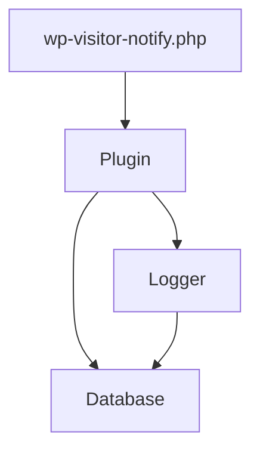

# WP Visitor Notify - Быстрый старт

*Краткий справочник по архитектуре плагина на основе анализа реального кода*

## 🏗️ Component Hierarchy

```
wp-visitor-notify.php (117 lines)
├── Autoloader (PSR-4: WPVN\ → includes/class-*.php)
├── Version checks (PHP 8.2+, WP 6.2+)
└── Plugin initialization hooks

WPVN\Plugin (697 lines) [SINGLETON]
├── Database (667 lines) [DEPENDENCY]
├── Logger (440 lines) [DEPENDENCY] 
└── Future components (TODO)
```

## 📊 Database Schema (5 Tables)

| Table | Purpose | Key Fields | Relationships |
|-------|---------|------------|---------------|
| `sessions` | Visitor tracking | session_id, ip_hash, device_type | 1:N → page_views |
| `page_views` | Page analytics | session_id, page_url, duration | N:1 ← sessions |
| `notification_rules` | Alert config | rule_type, conditions (JSON) | 1:N → history |
| `notification_history` | Sent alerts | rule_id, status, sent_at | N:1 ← rules |
| `logs` | System events | level, message, context (JSON) | Standalone |

## 🔄 Class Dependencies



## 🎯 Method Inventory

### Database Class (17 methods)
**Table Management:**
- `create_tables()`, `drop_tables()`, `tables_exist()`

**Data Operations:**
- `insert_session()`, `insert_page_view()`, `get_session()`
- `get_active_sessions()`, `get_analytics_data()`

**Maintenance:**
- `cleanup_old_records()`, `get_db_version()`

### Logger Class (17 methods)
**Logging:**
- `log()`, `debug()`, `info()`, `warning()`, `error()`, `critical()`

**Data Access:**
- `get_logs()`, `get_log_stats()`, `cleanup_old_logs()`

**Utilities:**
- `set_database()`, `should_log()`, `get_client_ip()`

### Plugin Class (16 methods)
**Lifecycle:**
- `get_instance()` [Singleton], `init()`, `on_activation()`, `on_deactivation()`

**Component Management:**
- `init_logger()`, `init_database()`, `get_component()`

**WordPress Integration:**
- `setup_admin_menu()`, `render_*_page()` methods
- `enqueue_admin_assets()`, `register_settings()`

## 🚀 Initialization Flow

1. **Bootstrap** (`wp-visitor-notify.php`)
   - Version checks → Admin notices if fail
   - Autoloader registration
   - `wpvn_init()` on `plugins_loaded`

2. **Plugin Init** (`WPVN\Plugin::init()`)
   - `init_logger()` → `new Logger()`
   - `init_database()` → `new Database()` + table creation
   - `logger->set_database(database)` dependency injection
   - `setup_basic_hooks()` → WordPress integration
   - Mark as initialized

3. **WordPress Hooks**
   - Admin: `admin_menu`, `admin_enqueue_scripts`, `admin_init`
   - Lifecycle: `activation_hook`, `deactivation_hook`

## 🔧 Configuration Points

### Constants (wp-visitor-notify.php)
- `WPVN_VERSION = '1.0.0'`
- `WPVN_PLUGIN_DIR`, `WPVN_PLUGIN_URL`

### Database Settings
- Schema version: `'1.0.0'`
- Data retention: 365 days (sessions), 90 days (logs)
- Table prefix: `wp_wpvn_*`

### Logger Settings
- Default level: `'info'`
- Fallback: WordPress `error_log()`
- Storage: Database table + JSON context

## ⚡ Key Design Patterns

### 1. Singleton Pattern
```php
class Plugin {
    private static ?Plugin $instance = null;
    
    public static function get_instance(): Plugin {
        if (null === self::$instance) {
            self::$instance = new self();
        }
        return self::$instance;
    }
    
    private function __construct() {} // Prevent direct instantiation
}
```

### 2. Dependency Injection
```php
class Plugin {
    private ?Database $database = null;
    private ?Logger $logger = null;
    
    private function init_logger(): void {
        $this->logger = new Logger();
    }
    
    private function init_database(): void {
        $this->database = new Database();
        $this->logger->set_database($this->database); // Injection
    }
}
```

### 3. WordPress Integration
```php
// Hooks registration
add_action('plugins_loaded', 'wpvn_init');
register_activation_hook(__FILE__, 'wpvn_activate');

// Admin interface
add_action('admin_menu', [$this, 'setup_admin_menu']);
```

## 🛡️ Security Implementation

### Data Protection
- IP hashing: `ip_hash` instead of raw IP storage
- Input sanitization: `sanitize_text_field()`, `esc_url_raw()`
- SQL injection prevention: Prepared statements
- Access control: `manage_options` capability checks

### Error Handling
```php
try {
    // Critical operations
    $this->init_database();
} catch (\Exception $e) {
    \error_log('WPVN Error: ' . $e->getMessage());
    // Show admin notice
}
```

## 📈 Performance Features

### Database Optimizations
- 6 indexes on sessions table including composite analytics index
- Proper data types (ENUMs, appropriate field sizes)
- Query limits (max 1000 log records)

### Memory Management
- Lazy component initialization
- Explicit null checks
- Singleton prevents multiple instances

## 🧪 Development Status

### ✅ Completed (Core Foundation)
- Database schema and operations
- Logging system with multiple levels
- Plugin orchestration (Singleton)
- Basic admin interface structure
- WordPress integration hooks

### 🔄 Partially Implemented
- Admin pages (basic stubs with database status)
- Settings registration (placeholder)

### ⏳ TODO (Future Development)
- `Tracker` class - Frontend JavaScript integration
- `Analytics` class - Data processing and metrics
- `Detector` class - Enhanced device/browser detection  
- `Notifier` class - Email alert system
- Complete Settings API implementation
- Frontend tracking scripts
- Cron job scheduling
- Internationalization (i18n)

## 🔍 Code Quality Metrics

- **Type Safety**: `declare(strict_types=1)` + PHP 8.2 type hints
- **Standards**: PSR-4 autoloading, PSR-3 logging levels
- **Documentation**: PHPDoc for all methods, inline Russian comments
- **Error Handling**: Try-catch blocks, graceful degradation
- **Security**: WordPress best practices, prepared statements

---

*Based on analysis of 1,921 lines of actual plugin code*
